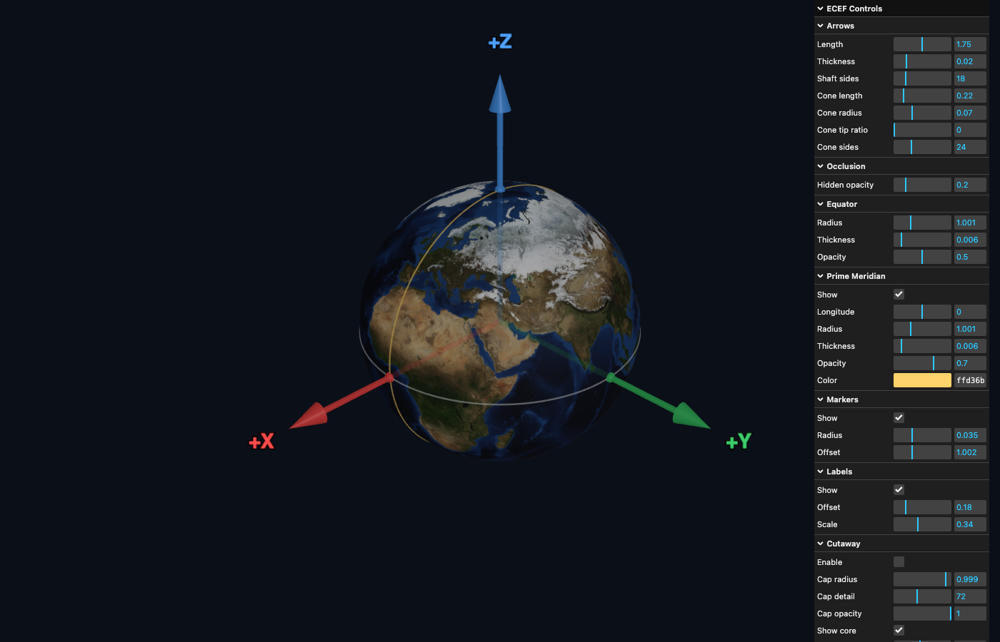
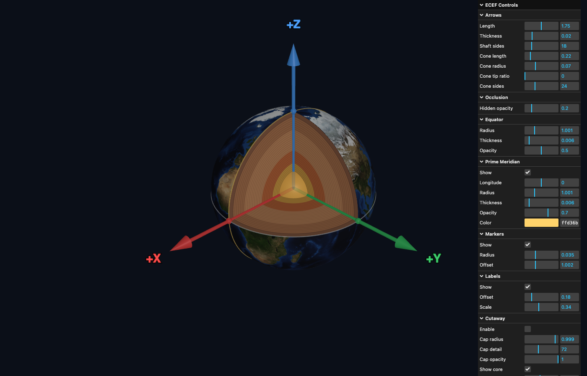

# ecef-axes

Minimal Three.js ECEF visualization with:

- Earth sphere (`R = 1`) with NASA Blue Marble texture
- +X, +Y, +Z ECEF axes rendered as arrows
- Occlusion-aware axis rendering (solid visible, semi-transparent when hidden)
- Equator and Prime Meridian rings
- Emergence markers and axis labels
- `lil-gui` controls for geometry and display parameters

## Screenshots

Without cutaway:



With cutaway:



## Run

From this directory:

```bash
python3 -m http.server 8081
```

Open:

- [http://127.0.0.1:8081/index.html](http://127.0.0.1:8081/index.html)

## Exporting PNGs

Use the `Export` folder in the GUI to save viewport images as PNG files. `Resolution x` renders to a higher-resolution off-screen target, `Transparent bg` exports with alpha, and `Filename` sets the base output name. The export captures only the 3D viewport (not the GUI overlay). The top-level `Background` color control affects non-transparent exports.

## Files

- `index.html`
- `ecef-axis-demo.js`
- `blue-marble-nasa-5400x2700.jpg`

## Texture Source

NASA Blue Marble:

- https://eoimages.gsfc.nasa.gov/images/imagerecords/73000/73909/world.topo.bathy.200412.3x5400x2700.jpg
